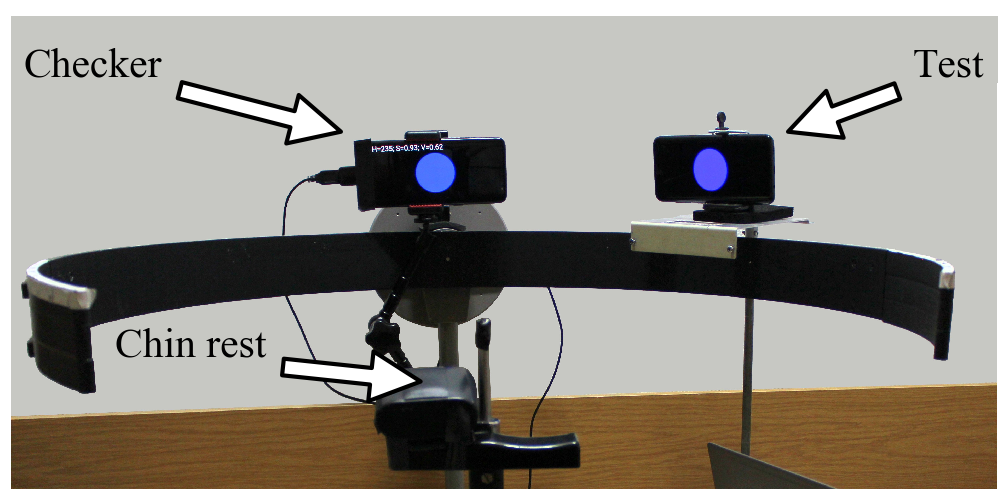
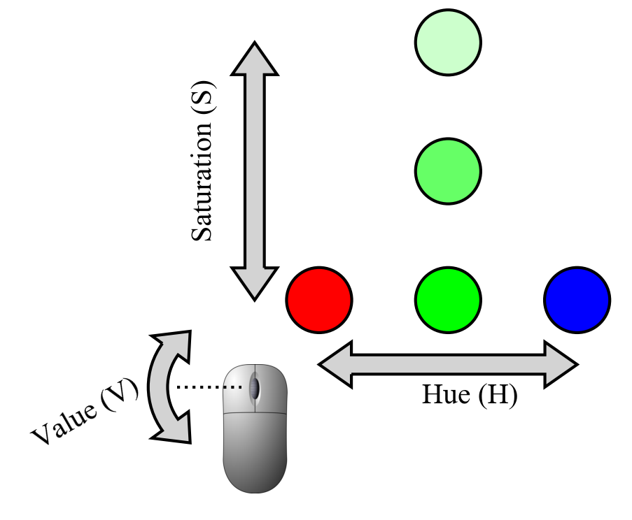

# spot
Software for peripheral vision experiments with two smartphones.

One smartphone is called Checker and is placed in the center of the primeter arc,
other smartphone is called Test and can move along the arc (see Fig.1). Smartphones are in "landscape" mode.

Figure 1. General view of the experimental setup.

Both smartphones are Samsung Galaxy S8.

The program hsv_40mm_center.html should be opened with web browser (e.g. Chrome) on the Checker smartphone.
This program allows subject to change HSV values with mouse according to Fig.2.
It shows stimulus (filled colored circle) at the center of the screen.
Stimulus diameter is 40 mm for Galaxy S8 and can be changed by changing value of the "radius" variable.
Left mouse click initially activate full screen mode, next clicks show/hide numerical HSV values at the top of the screen. 

Figure 2. Changing HSV values with mouse

For foveal matching one should use hsv_40mm_right.html program.
The only difference is the position of the stimulus near the right side of the screen.
